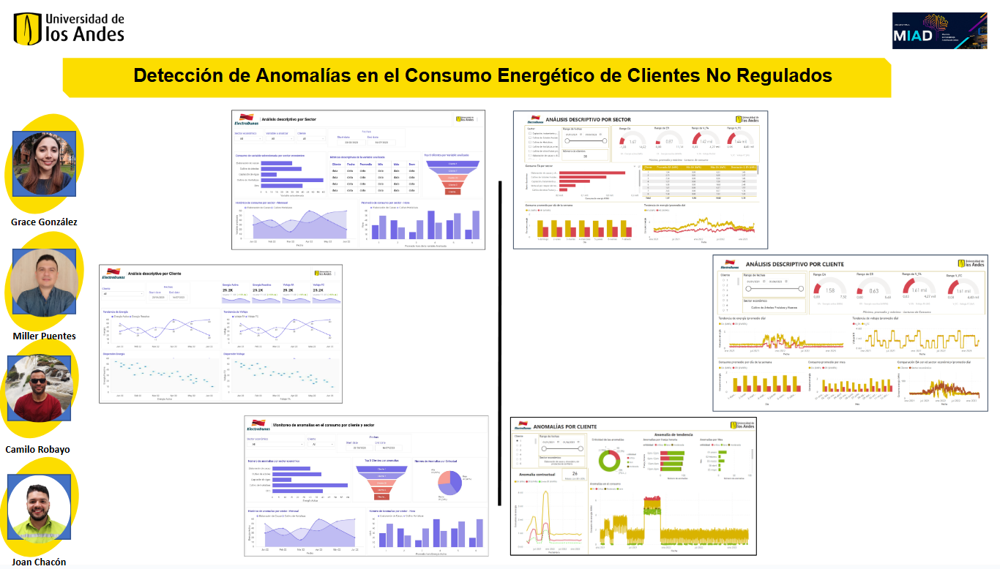

## ANÁLISIS DESCRIPTIVO Y DETECCIÓN DE ANOMALÍAS EN CLIENTES NO REGULADOS DE ELECTRODUNAS

### EletroDunas
Electro Dunas es un conglomerado peruano compuesto por tres empresas dedicadas a la distribución de energía eléctrica y a la ejecución de proyectos en el sector energé co. Electro Dunas ene su sede en la ciudad de Ica y su área de concesión abarca múl ples provincias en los departamentos de Ica, Huancavelica y Ayacucho, donde se ha centrado en brindar un servicio público de energía eléctrica de alta calidad, que contribuye significa vamente al desarrollo económico y social de la región.

Puntualmente, Electro Dunas ofrece suministro de energía eléctrica en media y baja tensión a clientes residenciales, empresas y en dades gubernamentales, cubriendo un área geográfica aproximada de 7,108 km² (Electrodunas, 2022). Sus instalaciones incluyen una red robusta compuesta por “14 Centros 1 de Transformación de 60/22.9/10 Kv, 458,8 kilómetros de líneas de sub-transmisión de 60 Kv, 2505 kilómetros de líneas de media tensión, 2934 kilómetros de líneas de baja tensión, 2359 subestaciones de transformación y 79245 luminarias de alumbrado público (según datos al 31/12/17)” (Electrodunas, 2022). 

### problemática
ElectroDunas, en su esfuerzo por alinearse con la iniciativa del Grupo Energía Bogotá (GEB) de utilizar análisis de datos para abordar diversos desafíos, está interesada en comprender mejor los patrones de comportamiento de sus clientes no regulados o libres. Este interés surge a raíz del significativo aumento en el volumen de estos clientes y la importancia de identificar anomalías relacionadas con pérdidas no técnicas. Actualmente, la empresa posee información comercial y técnica reportada por los medidores de cada uno de sus clientes no regulados. La información comercial incluye datos como el número de identificación del cliente y el sector de pertenencia(base de datos 1). La información técnica abarca los valores históricos de la energía activa entregada (kWh), la energía reactiva entregada (kVarh) y el voltaje registrado cada 15 minutos por los medidores (base de datos 2). A pesar de la disponibilidad de estos datos, su uso hasta ahora ha sido principalmente contable y financiero. Por ello, ha surgido la necesidad de implementar un proceso para identificar anomalías en los patrones de consumo mediante metodologías de análisis de datos, con el fin de mejorar la eficiencia y detectar posibles pérdidas no técnicas.

### Producto Mínimo Viable
Se espera que, como parte del desarrollo de esta inicia va, se logre un producto mínimo viable de acuerdo con lo requerido por Electro Dunas. El producto debe: 
1. Visualizar datos históricos de las variables para cada cliente. 
2. Desplegar un resumen descriptivo por cliente de su comportamiento histórico. 
3. Identificar consumos anómalos que no coincidan con los consumos esperados dado el comportamiento histórico. 
4. Mostrarle al usuario cuando un cliente presente un comportamiento anómalo y la cri cidad de éste de acuerdo con los modelos utilizados. 
5. Ser amigable con el usuario, con una interfaz clara y comprensible. 

Para revisar a detalle los requerimientos cumplidos a ElectroDunas con el Prototipo te invito a consulta el siguiente enlace: [Tabla de requerimientos](https://github.com/millerpuentes/ElectroDunas/blob/e2aa209f8f19ac8c7667e0469582c34257dfbe58/Entrega%203/1.%20Tabla%20de%20requerimientos/Tabla%20de%20Requerimientos.pdf)

Se puede explorar la solución analítica en el siguiente enlace:
[Dashboard ElectroDunas](https://app.powerbi.com/view?r=eyJrIjoiYjMzMjcxYzItNzJmMC00NjExLWJjNGEtNjU0ZmM4ZDU0MDNkIiwidCI6ImZhYTQ0ZmQ5LWRhYmUtNDA2NC1hNmJiLTU5NjA4ZWE5ZDBmMyIsImMiOjR9)

### Tabla de contenido

[Entrega 1](https://github.com/millerpuentes/ElectroDunas/tree/4f000d7417b196f3c496de0042ffb83423b7deb1/Entrega%201)

[Entrega 2](https://github.com/millerpuentes/ElectroDunas/tree/4f000d7417b196f3c496de0042ffb83423b7deb1/Entrega%202)

[Entrega 3](https://github.com/millerpuentes/ElectroDunas/tree/4f000d7417b196f3c496de0042ffb83423b7deb1/Entrega%203)

-[*3.1 Tabla de Requerimientos*](https://github.com/millerpuentes/ElectroDunas/tree/968d8c49483e2c4af0ab21a73bea6417f4a48d72/Entrega%203/1.%20Tabla%20de%20requerimientos) 

-[*3.2 Entregable del Prototipo*](https://github.com/millerpuentes/ElectroDunas/tree/4f000d7417b196f3c496de0042ffb83423b7deb1/Entrega%203/2.%20Entregable%20del%20prototipo)

-[*3.3 Presentación ejecutiva*](https://youtu.be/RbHyzCDAKmg)

-[*3.4 Documentos e instructivos*](https://github.com/millerpuentes/ElectroDunas/tree/4f000d7417b196f3c496de0042ffb83423b7deb1/Entrega%203/3.%20Documentos%20e%20Instructivos%20del%20prototipo)

### Desarrolladores: 

  

  <b>Joan Esteban Chacón</b>

  

  <b>Grace Gonzalez</b>

  

  <b>Camilo Robayo</b>

  

  <b>Miller Puentes</b>

  

  

